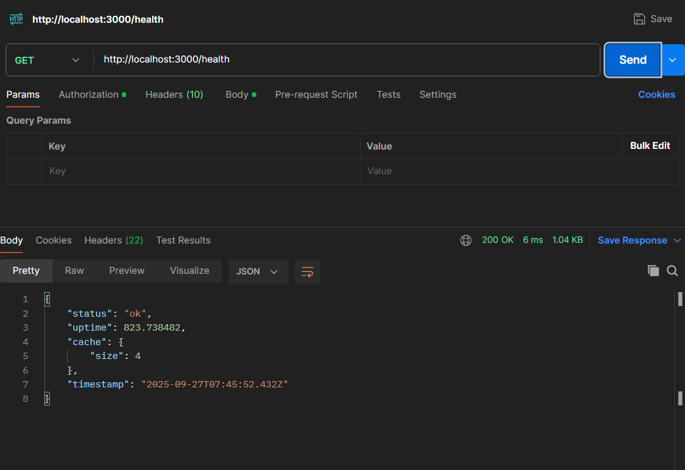
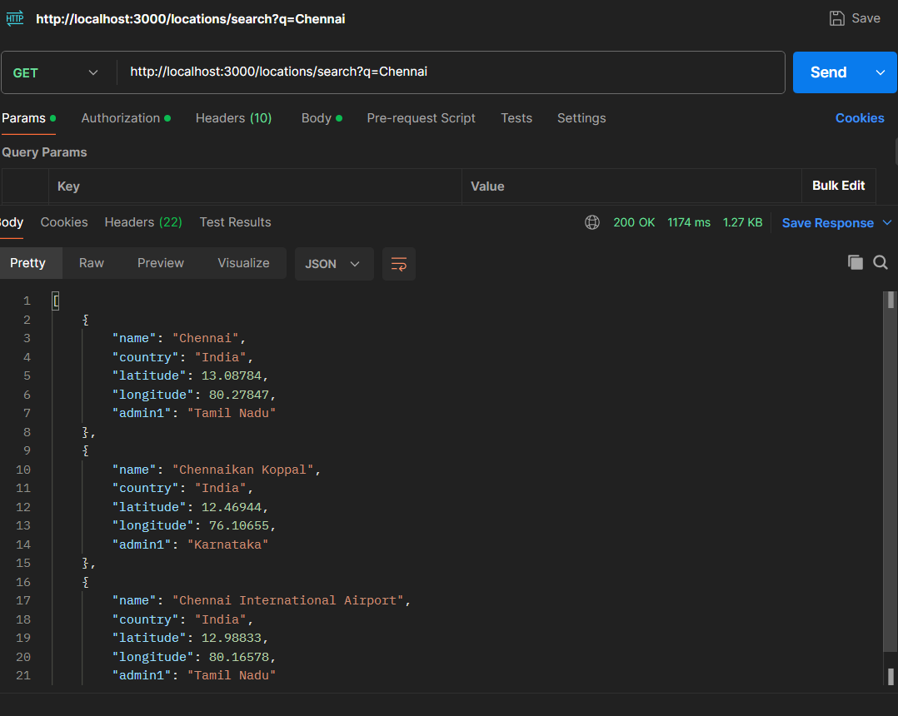
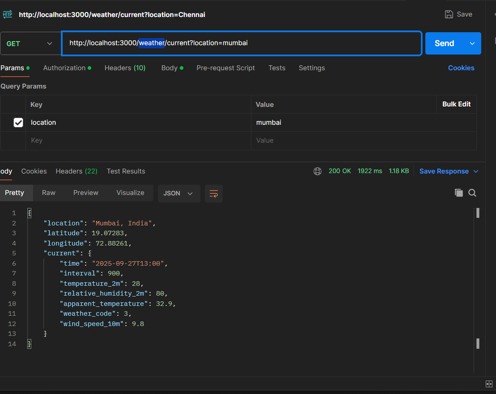
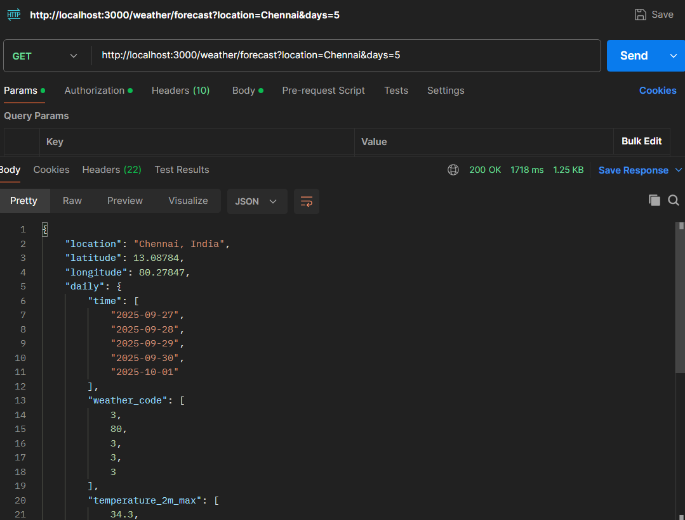

# 🌦 Weather API Service

A small, production-style REST API that returns **live weather data** using [Open-Meteo](https://open-meteo.com), with:

- Endpoints for **current weather**, **forecast**, **location search**, and **health**
- **TTL caching** to reduce external API calls
- **Rate limiting** to prevent abuse
- **Basic logging** and consistent **error handling**

> ✅ Works out of the box with **no API keys required**.  
> 🕒 Built and tested in IST (Asia/Kolkata).

---

## Setup Instructions

```bash
git clone https://github.com/<your-username>/weather-api.git
cd weather-api

npm install
npm install express dotenv helmet morgan express-rate-limit
npm run dev
npm start

```
## ENV file
PORT=3000
CACHE_TTL_SECONDS=300
RATE_LIMIT_PER_MIN=60


## ✨ Endpoints

| Method | Endpoint                                                    | Description                                   |
|--------|-------------------------------------------------------------|-----------------------------------------------|
| GET    | `/weather/current?location={city|lat,lon}`                   | Get current weather for a city or coordinates |
| GET    | `/weather/forecast?location={city|lat,lon}&days={1..10}`     | Get daily forecast for n days (default 5)     |
| GET    | `/locations/search?q={query}`                               | Search for location info (lat/lon)            |
| GET    | `/health`                                                   | Health check                                 |

### 🧪 Example Requests (curl)

```bash
# Health check
curl http://localhost:3000/health

# Search locations
curl "http://localhost:3000/locations/search?q=Chennai"

# Current weather by city
curl "http://localhost:3000/weather/current?location=Chennai"

# Current weather by coordinates
curl "http://localhost:3000/weather/current?location=13.0827,80.2707"


# 5-day forecast
curl "http://localhost:3000/weather/forecast?location=Chennai&days=5"
```
## OUTPUT
## 📸 Screenshots

### 🩺 Health Endpoint


### 🌍 Location Search


### 🌤 Current Weather


### 📅 5-Day Forecast


